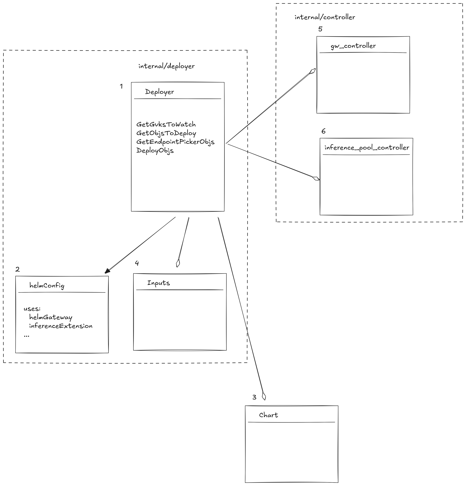
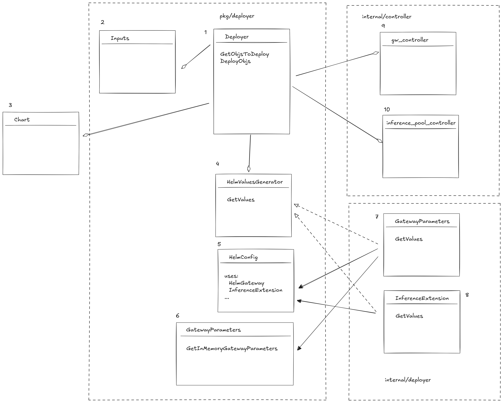

# EP-11376: Open up Deployer for Downstream Reuse
 
Status:
 
Issue: https://github.com/kgateway-dev/kgateway/issues/11376
 
## Background
Currently kgateway uses a Deployer to automate deploying of gateways and inference pools. Its implementation is tightly coupled with internal representation of gateways, gateway parameters, associated helm chart values, and the inference pool extension is treated as a special case while largely relying abstractions originally developed for gateways.
The Deployer pattern and its implementation could be reused for handling of deployments of components other than gateways (and extension pools) by creating a common interface for rendering of charts and pushing gateway-specific chart rendering code into a dedicated concrete implementation of that interface.

## Goals
1. Decouple Deployer from implementation details of gateway and inference pool helm chart rendering
2. Make Deployer a public sub-module so it can be reused in both kgateway and downstream projects
3. Make GatewayParameter merging logic available to downstream projects

## Implementation Details

#### Current State

1. Deployer exposes a set of functions to render (GetObjsToDeploy, GetEndpointPickerObjs) and deploy (DeployObjs) for gateways and inference pools. The deployer uses hard-coded logic and configuration in Inputs (4) to automatically configure itself for deploying of gateways or inference pools. Rendering of values and helm charts for gateways and inference pools is an implementation detail not exposed outside of internal/deployer package.
2. helmConfig is used to store helm values generated during GetObjsToDeploy and GetEndpointPickerObjs calls and is not accessible outside of internal/deployer package.
3. Chart is a reference to a helm chart (helm module) 
4. Inputs is a set of options used to configure the deployer, such as control plane xds config, inference extension config, image repository config, etc. These are used during rendering of helm charts.
5, 6. controllers use Deployer to render kgateway and inference extension charts and then sync the changes to the k8s cluster.

#### Proposed Changes

1. Move Deployer into pkg/deployer package; reduce its interface to GetObjsToDeploy (rendering of charts) and DeployObjs (syncing objects to the k8s cluster).
2. Move Inputs into pkg/deployer package; it's a direct dependency of Deployer and is required to create an instance of one.
3. Chart is a reference to a helm chart (helm module). Charts are no longer loaded inside Deployer factory function, instead it becomes a responsibility of the controllerBuilder.
4. HelmValuesGenerator is a common interface for generating of helm values used with helm charts. Implementations for handling of gateway parameters (7) and inference extensions (8) reside in internal/deployer package.
5. HelmConfig is now a public struct that is used to store helm values for gateway and inference extension charts. This is done to support reuse of gateway parameters helm values generation in downstream projects.
6. pkg/deployer/GatewayParameters is a module that makes kgateway default config parameters available for reuse in downstream projects
7, 8. Helm values renderers, instantiated by controllerBuilder and then injected into a Deployer instance.
9, 10. controllers use Deployer to render kagteway and inference extension charts and then sync the changes to the k8s cluster.

## PoC Implementation
https://github.com/kgateway-dev/kgateway/pull/11377